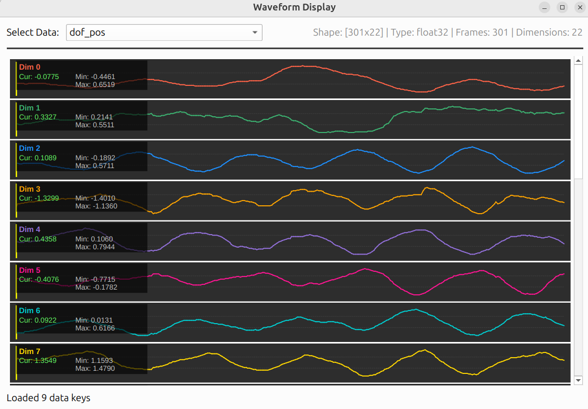

# GMR Motion Editor

一个基于PyQt6的GMR机器人运动数据可视化编辑器，支持导入、剪辑和导出GMR格式数据。

**[English](README.md) | [中文](README_CN.md)**

<!-- GIF演示图片 - 通过修改width属性调整宽度 (例如: width="600", width="80%") -->


## 功能特性

- **导入/导出**: 支持加载和保存 `.pkl` 格式的GMR运动数据
- **可视化**: 使用MuJoCo实时渲染机器人运动
- **波形显示**: 独立窗口显示各数据维度的波形曲线，支持实时帧同步

   
- **剪辑**: 简单的起止时间裁剪功能，导出选定片段
- **多机器人支持**: 支持项目中所有17种机器人模型

## 安装与配置

### 1. 放置位置（推荐）

**推荐做法**：将 `motion_editor` 文件夹放在 GMR 项目的根目录下：

```
GMR/                          # GMR项目根目录
├── general_motion_retargeting/
├── assets/
├── motion_editor/            # <-- 放在这里
│   ├── motion_editor.py
│   ├── src/
│   └── README.md
└── ...
```

**优点**：
- 自动检测 GMR 路径，无需手动配置
- 启动时会自动找到 GMR 项目的机器人模型和数据

### 2. 放置在其他位置（可选）

如果你希望将 `motion_editor` 放在其他位置（例如独立的工作目录），需要手动配置 GMR 路径：

**步骤**：

1. **编辑配置文件**：`motion_editor/src/gui/config.py`

2. **设置 GMR 路径**：

```python
# GMR项目的根目录路径
GMR_ROOT_PATH = "/path/to/your/GMR"  # <-- 修改为你的GMR路径
```

**示例**：

```python
# Linux/macOS
GMR_ROOT_PATH = "/home/username/Projects/GMR"

# Windows
GMR_ROOT_PATH = "C:/Users/username/Documents/GMR"
```

### 3. 安装依赖

确保已安装 PyQt6：

```bash
pip install PyQt6
```

其他依赖（mujoco, numpy 等）需要在 GMR 项目中预先安装。

### 4. 验证配置

启动编辑器时会自动验证配置：
- ✅ 如果配置正确，会显示 "Valid GMR installation"
- ❌ 如果配置错误，控制台会提示错误信息和解决方案

**验证要求**：
- 路径必须指向 GMR 项目的根目录
- 必须包含 `general_motion_retargeting/` 和 `assets/` 目录

## 使用方法

### 启动编辑器

```bash
# 进入 motion_editor 目录
cd motion_editor

# 启动编辑器
python motion_editor.py

# 或带文件路径启动（自动打开指定文件）
python motion_editor.py /path/to/motion_data.pkl
```

### 界面说明

1. **机器人选择**: 从下拉菜单选择对应的机器人类型
2. **播放控制**: 
   - ▶ Play / ⏸ Pause: 播放/暂停
   - ⏹ Stop: 停止并重置到起始位置
   - ⏮ / ⏭: 上一帧/下一帧
   - ⏮⏮ / ⏭⏭: 跳到裁剪范围开始/结束
3. **时间轴**:
   - 蓝色手柄: 裁剪起点
   - 红色手柄: 裁剪终点
   - 黄色竖线: 当前帧位置
4. **导出**: 点击"📤 Export Clip"导出裁剪后的片段

### 波形显示

波形显示窗口提供运动数据的详细可视化：

1. **打开波形窗口**: View → Waveform Display（或按 `Ctrl+W`）
2. **选择数据**: 从下拉菜单中选择（如 root_pos、dof_pos、root_euler 等）
3. **查看波形**: 每个维度以单独一行显示，包含：
   - 完整波形曲线
   - 维度名称（彩色标签）
   - 当前值（Cur）- 实时更新
   - 最小值（Min）
   - 最大值（Max）
   - 黄色竖线指示当前帧位置
4. **支持的数据类型**:
   - 1D数组：单条波形
   - 2D数组：每维一行（如3D位置显示X、Y、Z）
   - 3D数组：展平显示（如关键点位置显示为 Body 0 X、Body 0 Y等）
   - 标量值：显示为水平直线

### 快捷键

- `Space`: 播放/暂停
- `← / →`: 上一帧/下一帧
- `Home`: 跳到裁剪范围开始
- `End`: 跳到裁剪范围结束
- `Ctrl+O`: 打开文件
- `Ctrl+S`: 保存文件
- `Ctrl+Shift+S`: 另存为
- `Ctrl+W`: 打开波形显示窗口

## 示例工作流程

1. 运行 `python motion_editor.py`
2. File → Open，选择一个 `.pkl` 运动数据文件
3. 在机器人选择下拉框中选择对应的机器人类型
4. 点击播放按钮查看运动
5. 拖动时间轴上的蓝色和红色手柄设置裁剪范围
6. 点击"Export Clip"导出裁剪后的片段

## 项目结构

```
motion_editor/
├── docs/                           # 文档
│   ├── gmr_visualizer_design.md   # 设计文档
│   └── implementation_plan.md     # 实施计划
├── src/                           # 源代码
│   └── gui/                       # GUI模块
│       ├── __init__.py
│       ├── config.py             # GMR路径配置 ⭐
│       ├── gmr_manager.py        # 数据管理
│       ├── motion_controller.py  # 播放控制
│       ├── timeline_widget.py    # 时间轴控件
│       ├── wave_widget.py        # 波形显示控件
│       └── main_window.py        # 主窗口
├── tests/                         # 测试文件
│   ├── test_gmr_manager.py
│   ├── test_timeline_widget.py
│   └── test_motion_controller.py
├── motion_editor.py              # 启动脚本
└── README.md                     # 本文件
```

**重要文件**：
- `src/gui/config.py` - **GMR路径配置文件**，编辑此文件设置GMR项目路径

## 支持的机器人

支持GMR项目中的所有17种机器人模型：

- Unitree G1 (29 DOF)
- Unitree G1 with Hands (43 DOF)
- Unitree H1 (19 DOF)
- Unitree H1 2 (27 DOF)
- Booster T1
- Booster T1 29dof
- Booster K1 (22 DOF)
- Stanford ToddlerBot
- Fourier N1
- ENGINEAI PM01
- HighTorque Hi (25 DOF)
- Galaxea R1 Pro (24 DOF)
- Kuavo S45 (28 DOF)
- Berkeley Humanoid Lite (22 DOF)
- PND Adam Lite (25 DOF)
- Tienkung (20 DOF)
- PAL Robotics' Talos (30 DOF)
- Fourier GR3 (31 DOF)

## 开发说明

### 运行测试

```bash
cd motion_editor
python tests/test_gmr_manager.py
python tests/test_timeline_widget.py
python tests/test_motion_controller.py
```

### 技术栈

- Python 3.10+
- PyQt6 (GUI框架)
- MuJoCo (3D渲染)
- NumPy (数据处理)

## 许可证

本项目基于GMR项目，遵循MIT许可证。
